<p align="center">
  
</p>

<h1 align="center">Obzorarr</h1>

<p align="center">
  <strong>Year in Review for Plex Media Server</strong>
</p>

<p align="center">
  <a href="https://github.com/engels74/obzorarr/blob/main/LICENSE"></a>
  
  
  
  
  <a href="https://deepwiki.com/engels74/obzorarr"></a>
</p>

---

## What is Obzorarr?

Obzorarr is a **"Plex Wrapped"** application that syncs viewing history from your Plex Media Server and generates yearly statistics with an animated slideshow presentation - similar to Spotify Wrapped. It doesn't require Tautulli; it only relies on the [Plex API](https://developer.plex.tv/pms/).

## Features

<p align="center">
  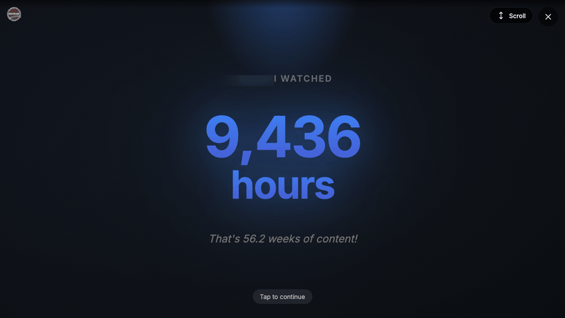
</p>

- **Yearly Statistics** — Total watch time, top movies, shows, and genres
- **Animated Slideshow** — Beautiful, interactive presentation of your viewing habits
- **Watch Patterns** — Monthly and hourly distribution charts
- **Percentile Rankings** — See how you compare to other users on your server
- **Plex OAuth** — Secure authentication with your Plex account
- **Automatic Sync** — Scheduled background sync of viewing history
- **AI Fun Facts** — Optional AI-generated personalized insights

## Issues & Support

Found a bug or have a feature request? Please submit issues and feature requests to the **[obzorarr-docker repository](https://github.com/engels74/obzorarr-docker/issues)** rather than this repository. This ensures your report reaches the maintainers monitoring issue tracking across the project.

## Screenshots

<details>
<summary><strong>Admin Dashboard</strong></summary>
<br>

|                                     Dashboard                                      |                                     Settings                                      |                                Sync Management                                |
| :--------------------------------------------------------------------------------: | :-------------------------------------------------------------------------------: | :---------------------------------------------------------------------------: |
| 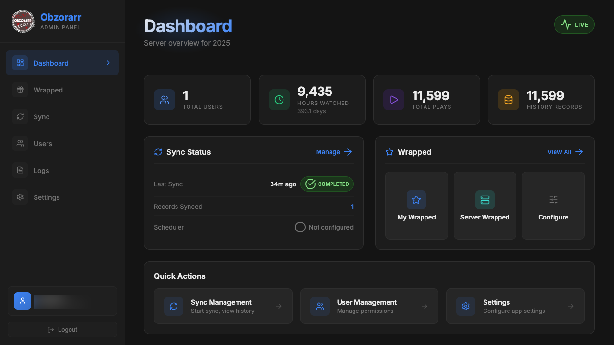 | 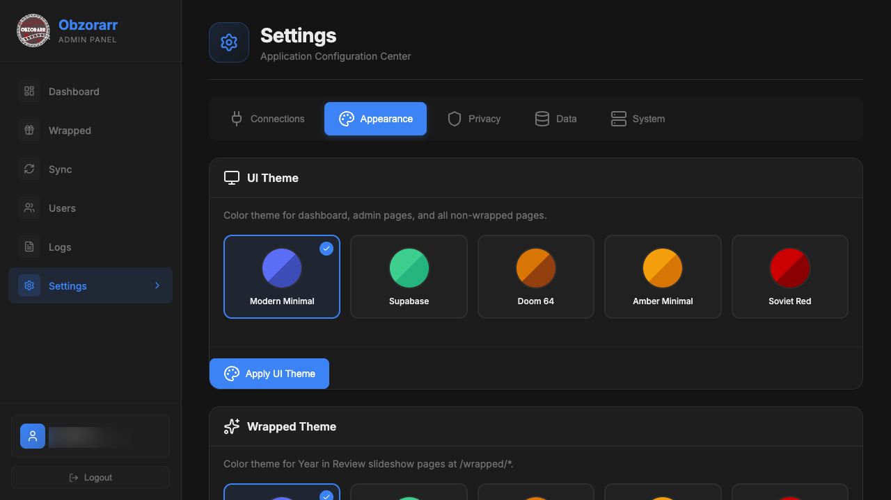 | 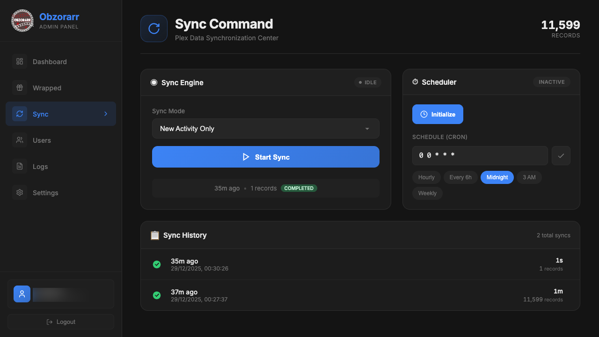 |

<p align="center">
  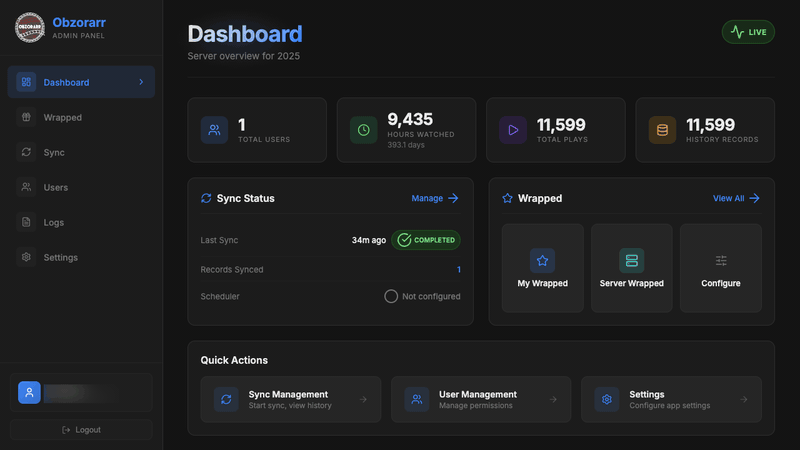
</p>

</details>

<details>
<summary><strong>Wrapped Presentation</strong></summary>
<br>

|                                    Total Time                                     |                                    Top Movies                                     |
| :-------------------------------------------------------------------------------: | :-------------------------------------------------------------------------------: |
| 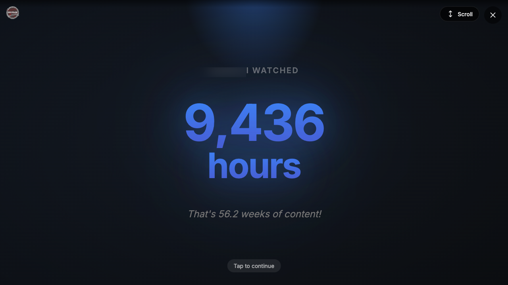 | 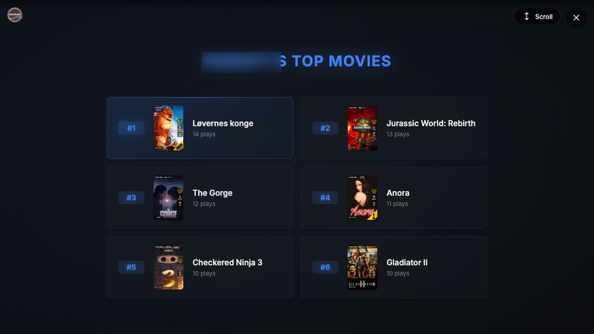 |

|                                    Top Shows                                     |                                    Genres                                     |
| :------------------------------------------------------------------------------: | :---------------------------------------------------------------------------: |
| 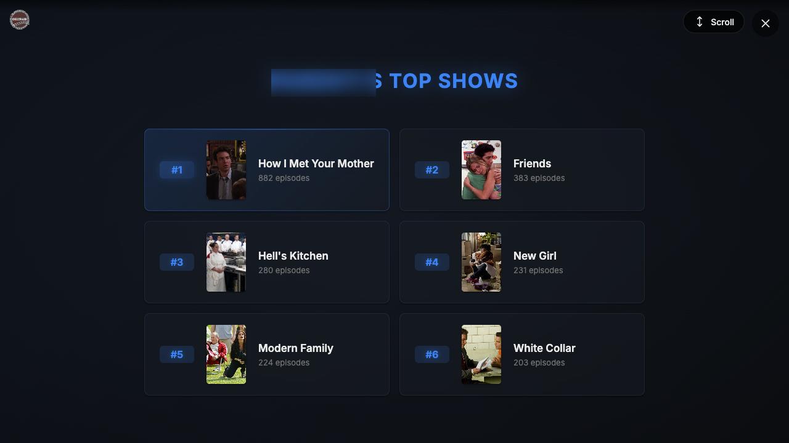 | 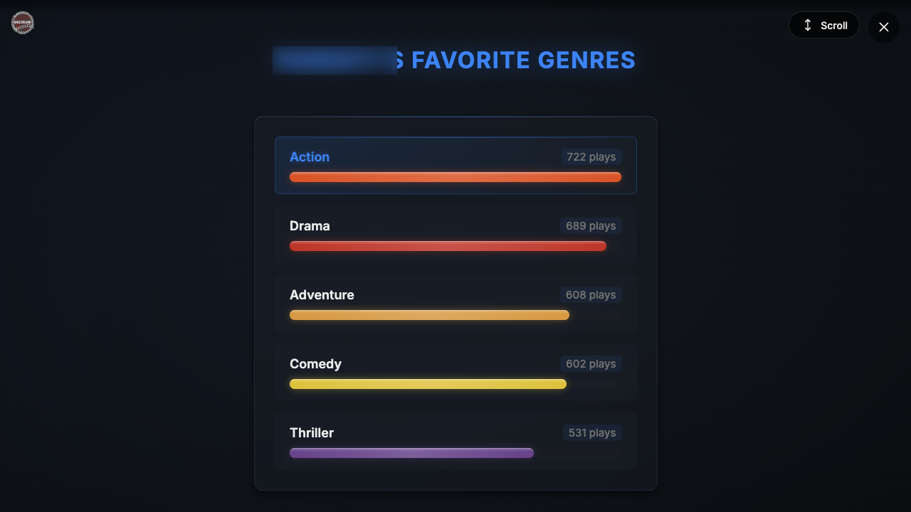 |

|                                Percentile Ranking                                 |                                    Fun Facts                                    |
| :-------------------------------------------------------------------------------: | :-----------------------------------------------------------------------------: |
| 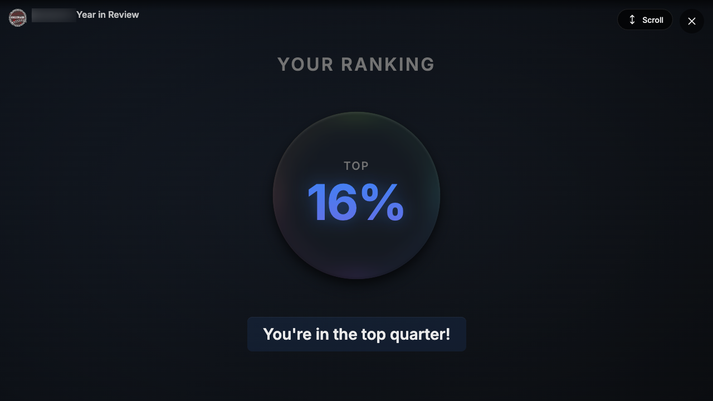 | 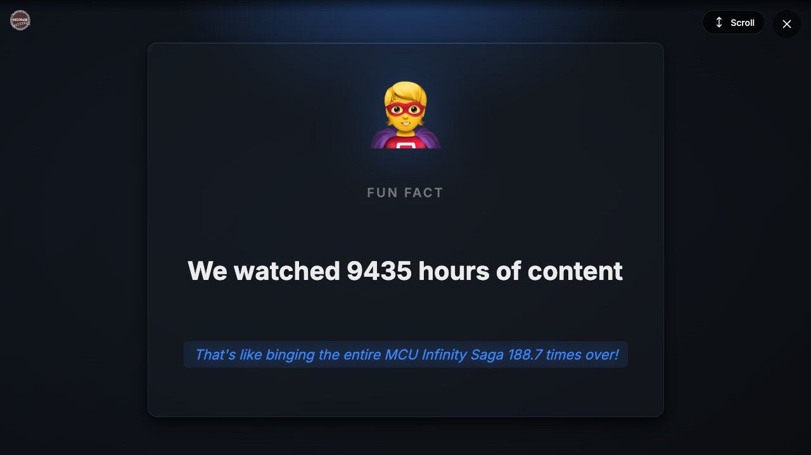 |

|                                    Summary                                     |                                       Share                                        |
| :----------------------------------------------------------------------------: | :--------------------------------------------------------------------------------: |
| 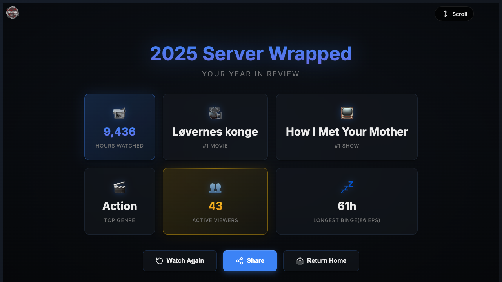 | 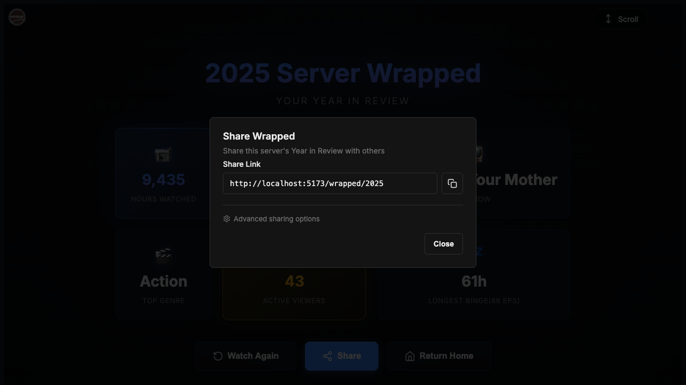 |

</details>

## Tech Stack

| Component | Technology             |
| --------- | ---------------------- |
| Runtime   | Bun                    |
| Framework | SvelteKit + Svelte 5   |
| Database  | SQLite (Drizzle ORM)   |
| Styling   | UnoCSS + shadcn-svelte |
| Animation | GSAP + Motion          |

## Quick Start

### Docker (Recommended) — [Image Repo](https://github.com/engels74/obzorarr-docker)

```yaml
services:
  obzorarr:
    container_name: obzorarr
    image: ghcr.io/engels74/obzorarr-docker
    ports:
      - 3000:3000
    environment:
      - PUID=1000
      - PGID=1000
      - UMASK=002
      - TZ=Etc/UTC
      - PLEX_SERVER_URL=http://plex-url-here:32400
      - PLEX_TOKEN=your-plex-token-here
    volumes:
      - /<host_folder_config>:/config
```

Replace `/<host_folder_config>` with your desired config path. Access the web UI at `http://localhost:3000` to complete setup.

### From Source

```bash
git clone https://github.com/engels74/obzorarr.git
cd obzorarr
cp .env.example .env
bun install
bun run dev
```

## License

This project is licensed under the [GNU Affero General Public License v3.0](LICENSE).
