<p align="center">
  
</p>

<h1 align="center">Obzorarr</h1>

<p align="center">
  <strong>Year in Review for Plex Media Server</strong>
</p>

<p align="center">
  <a href="https://github.com/engels74/obzorarr/blob/main/LICENSE"></a>
  
  
  
  
  <a href="https://deepwiki.com/engels74/obzorarr"></a>
</p>

---

## What is Obzorarr?

Obzorarr is a **"Wrapped for Plex"** application that syncs viewing history from your Plex Media Server and generates yearly statistics with an animated slideshow presentation - similar to Spotify Wrapped. It doesn't require Tautulli; it only relies on the [Plex API](https://developer.plex.tv/pms/).

## Features

<p align="center">
  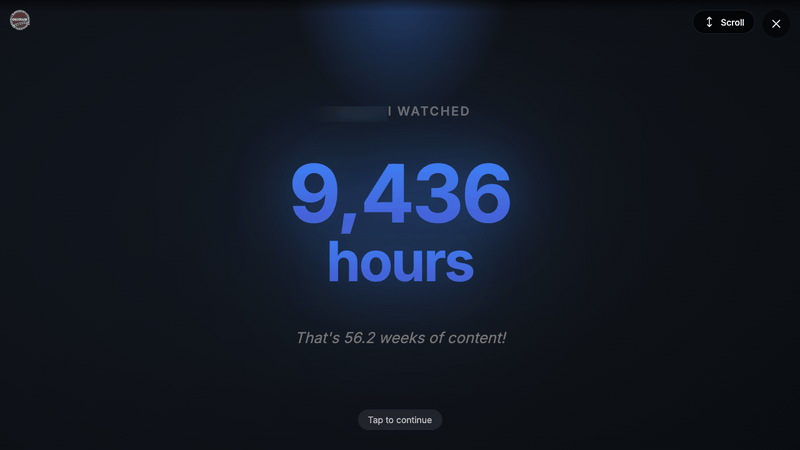
</p>

- **Yearly Statistics** — Total watch time, top movies, shows, and genres
- **Animated Slideshow** — Beautiful, interactive presentation of your viewing habits
- **Watch Patterns** — Monthly and hourly distribution charts
- **Percentile Rankings** — See how you compare to other users on your server
- **Plex OAuth** — Secure authentication with your Plex account
- **Automatic Sync** — Scheduled background sync of viewing history
- **AI Fun Facts** — Optional AI-generated personalized insights

## Issues & Support

Found a bug or have a feature request? Please submit issues and feature requests to the **[obzorarr-docker repository](https://github.com/engels74/obzorarr-docker/issues)** rather than this repository. This ensures your report reaches the maintainers monitoring issue tracking across the project.

## Screenshots

<details>
<summary><strong>Admin Dashboard</strong></summary>
<br>

|                                     Dashboard                                      |                                     Settings                                      |                                Sync Management                                |
| :--------------------------------------------------------------------------------: | :-------------------------------------------------------------------------------: | :---------------------------------------------------------------------------: |
| 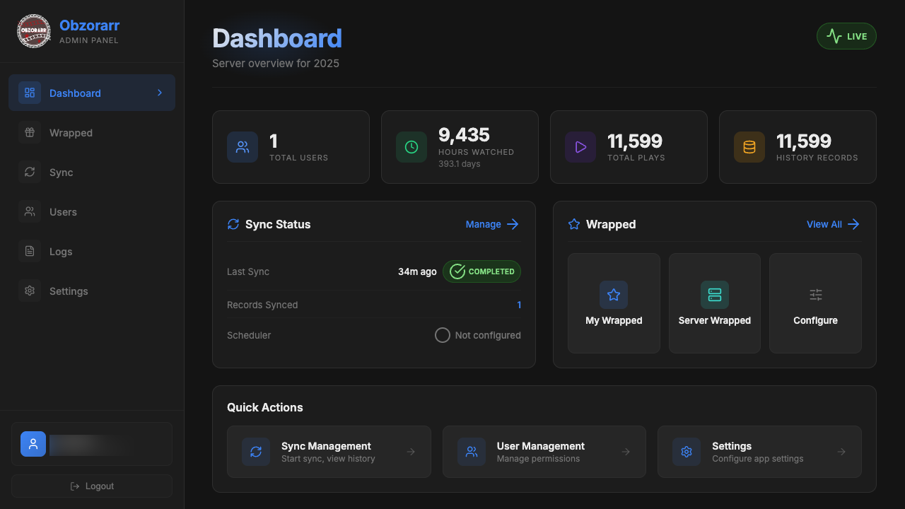 | 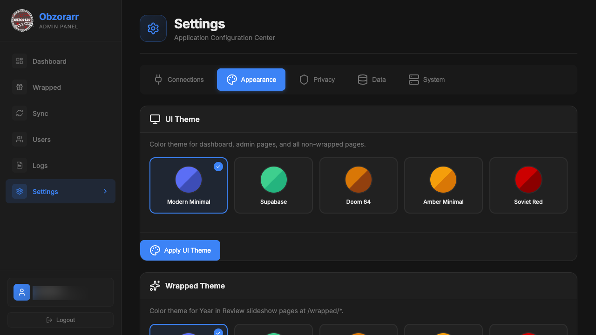 | 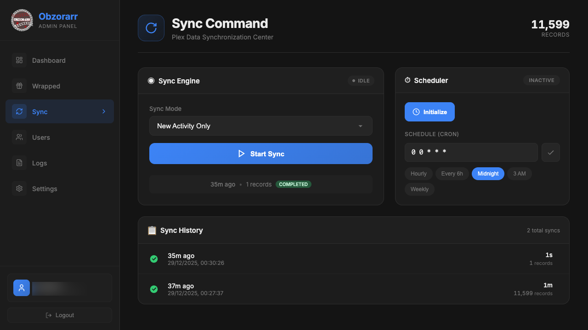 |

<p align="center">
  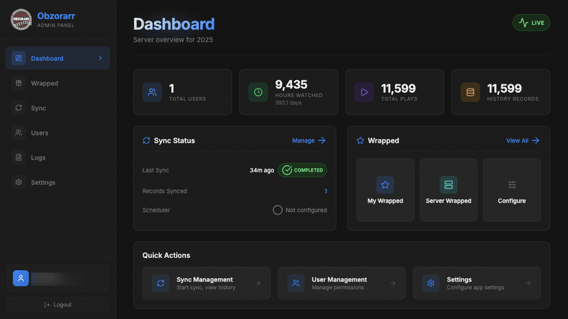
</p>

</details>

<details>
<summary><strong>Wrapped Presentation</strong></summary>
<br>

|                                    Total Time                                     |                                    Top Movies                                     |
| :-------------------------------------------------------------------------------: | :-------------------------------------------------------------------------------: |
| 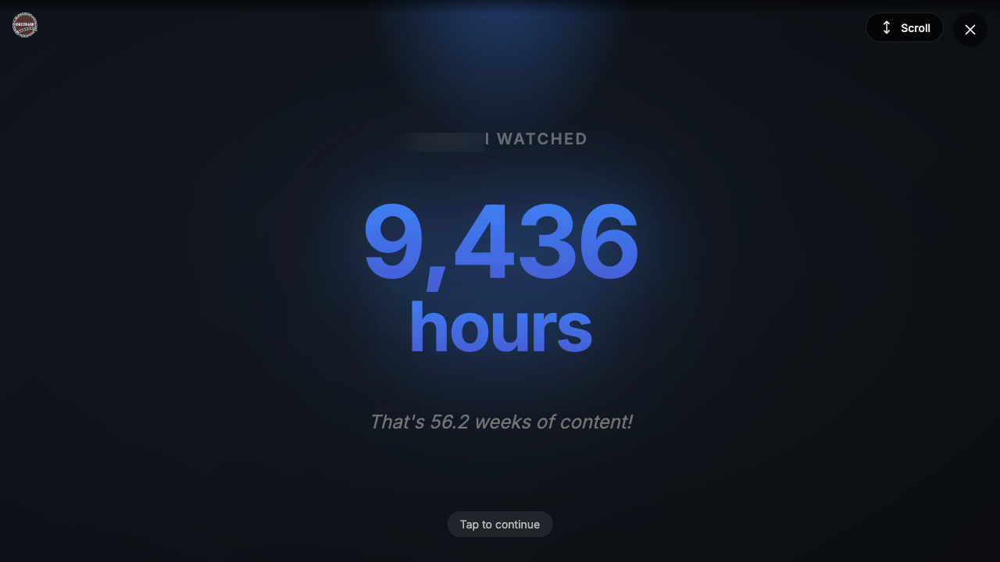 | 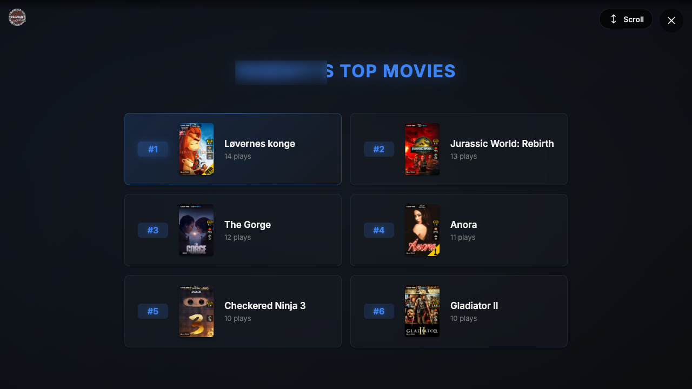 |

|                                    Top Shows                                     |                                    Genres                                     |
| :------------------------------------------------------------------------------: | :---------------------------------------------------------------------------: |
| 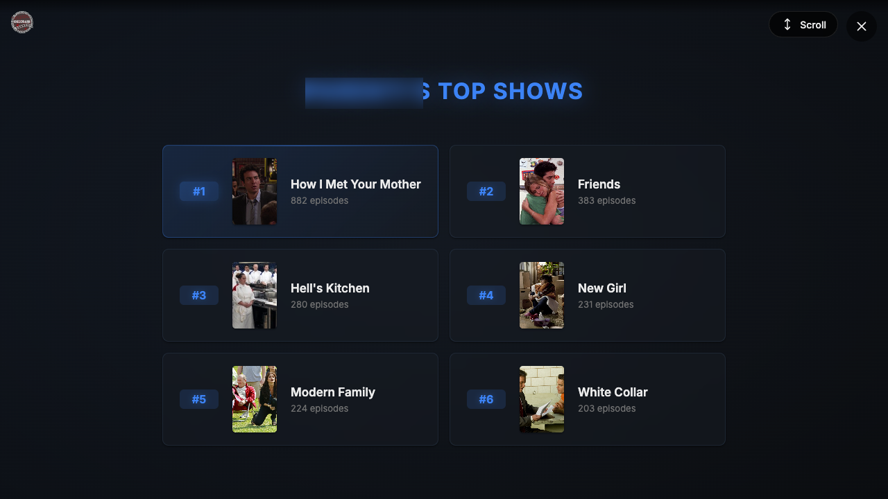 | 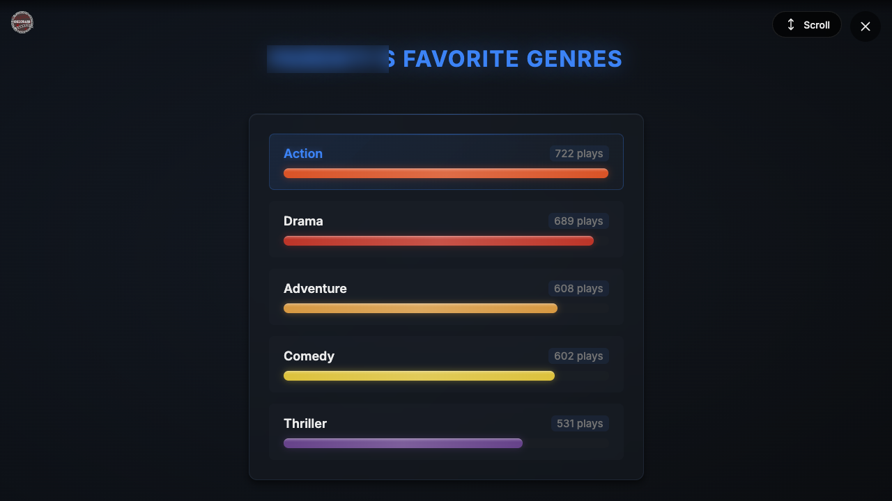 |

|                                Percentile Ranking                                 |                                    Fun Facts                                    |
| :-------------------------------------------------------------------------------: | :-----------------------------------------------------------------------------: |
| 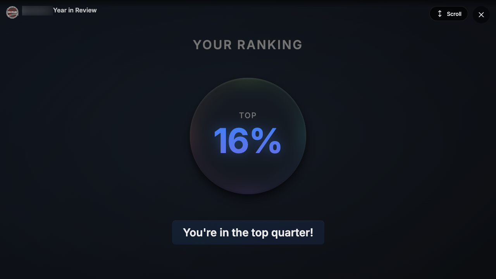 | 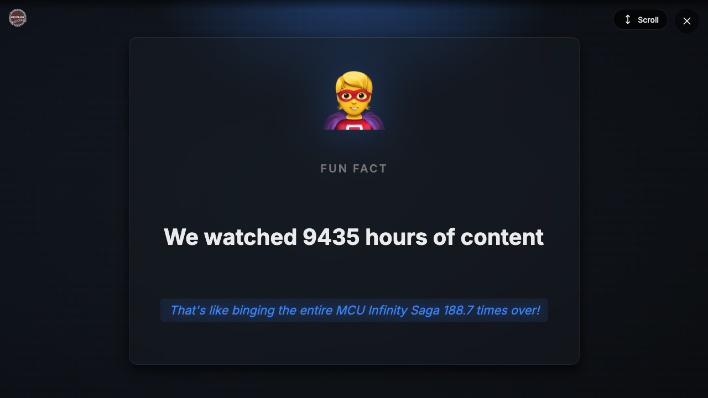 |

|                                    Summary                                     |                                       Share                                        |
| :----------------------------------------------------------------------------: | :--------------------------------------------------------------------------------: |
| 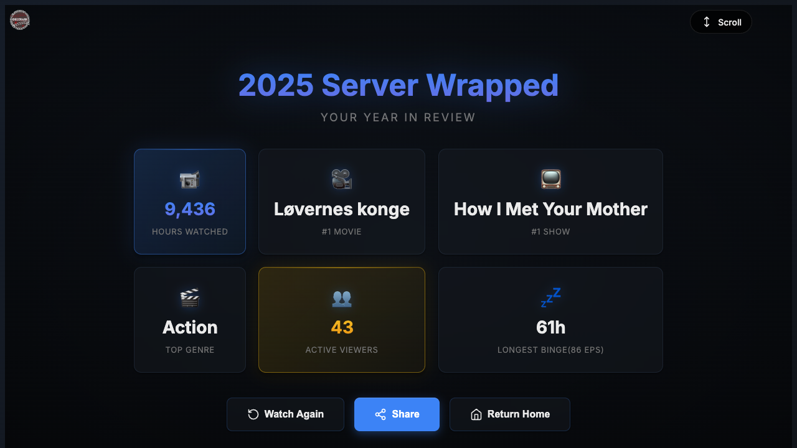 | 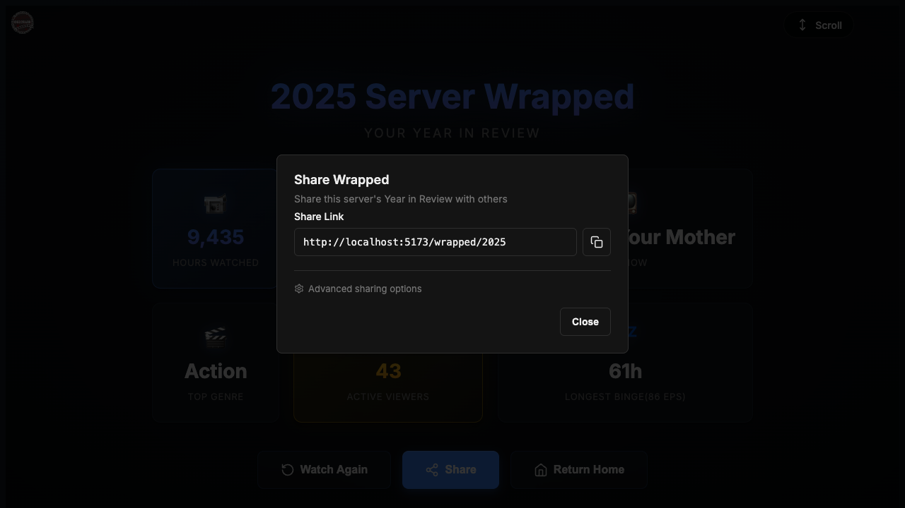 |

</details>

## Tech Stack

| Component | Technology             |
| --------- | ---------------------- |
| Runtime   | Bun                    |
| Framework | SvelteKit + Svelte 5   |
| Database  | SQLite (Drizzle ORM)   |
| Styling   | UnoCSS + shadcn-svelte |
| Animation | GSAP + Motion          |

## Quick Start

### Docker (Recommended) — [Image Repo](https://github.com/engels74/obzorarr-docker)

```yaml
services:
  obzorarr:
    container_name: obzorarr
    image: ghcr.io/engels74/obzorarr-docker
    ports:
      - 3000:3000
    environment:
      - PUID=1000
      - PGID=1000
      - UMASK=002
      - TZ=Etc/UTC
      # Optional: lock Plex connection at the env layer. You can also leave
      # these unset and configure the server from the admin UI after onboarding.
      # - PLEX_SERVER_URL=http://plex-url-here:32400
      # - PLEX_TOKEN=your-plex-token-here
    volumes:
      - /<host_folder_config>:/config
```

Replace `/<host_folder_config>` with your desired config path. Access the web UI at `http://localhost:3000` to complete setup.

### From Source

```bash
git clone https://github.com/engels74/obzorarr.git
cd obzorarr
cp .env.example .env
bun install
bun run dev
```

> **Note on `.env` in local dev.** `bun run dev` does **not** auto-load `.env`, so any
> `PLEX_SERVER_URL` / `OPENAI_*` values you put there are ignored — local dev configures the
> server through onboarding and the admin UI (values stored in the SQLite DB). Environment-variable
> precedence (and the "Locked by environment variable" UI) applies to **Docker/production**, where
> the container passes the vars into the process. To exercise env-precedence locally (e.g. to see an
> env-locked field render its `ENV` badge), run `bun run dev:env`, which loads `.env` via
> `--env-file`.

## First-Time Setup

The first time you open the web UI, Obzorarr runs a short onboarding wizard:
**Claim → Security → Reverse proxy → Connect → Sync → Configure**.

### The claim token

So nobody can grab your fresh install before you do, the first step asks for a one-time
**bootstrap token**. Obzorarr prints it to the server console — it is never shown in the browser:

```
Obzorarr initial setup requires a bootstrap claim.
Setup URL: http://localhost:3000/onboarding/claim
Bootstrap token: xxxx-xxxx-xxxx
```

With Docker, read it from the container logs:

```bash
docker logs obzorarr
```

The token expires after 15 minutes and only one browser can hold the claim at a time. If it lapses,
restart Obzorarr to print a new one.

The remaining steps connect your Plex server (or confirm the values you set via `PLEX_SERVER_URL` /
`PLEX_TOKEN`), run the first history sync, and let you choose which slides users see. Anything set
here can be changed later under **Admin → Settings**.

## Running Behind a Reverse Proxy

Obzorarr needs to know the address **your browser** uses, not the internal one it listens on.
Otherwise login redirects, share links, and CSRF checks get built from the wrong hostname.

Set `ORIGIN` to your public URL, including the port if it isn't 80 or 443:

```env
ORIGIN=https://obzorarr.example.com
```

That covers most setups. `TRUST_PROXY` is a separate, optional switch: when enabled, Obzorarr takes
the hostname and protocol from the `X-Forwarded-Host` and `X-Forwarded-Proto` headers your proxy
sends instead. Only turn it on when **both** of these are true:

- Obzorarr can only be reached through the proxy — nothing can hit it directly.
- Your proxy sets both headers itself, overwriting whatever a visitor sends.

If either is false, a visitor can forge those headers and make Obzorarr build links pointing at a
domain they control. When in doubt, leave `TRUST_PROXY` off and rely on `ORIGIN`.

Onboarding and **Admin → Settings → Security** include a diagnostic that compares what your browser
sees, what the proxy forwards, and what Obzorarr actually uses, with hints for Caddy, Nginx, Nginx
Proxy Manager, and Apache. Changing either variable through the environment requires a restart.
(Client-IP detection is configured separately, via the Bun adapter's `ADDRESS_HEADER` and
`XFF_DEPTH`.)

## How Plex Users Are Matched

Plex watch history records a *server-local* account ID rather than a global Plex identity, so on
every sync Obzorarr rebuilds the mapping between those local IDs and real Plex users by comparing
your server's account list with the users you've shared the server with. In practice:

- **You, the server owner, are always local account `1`.** Never edit account IDs by hand.
- **A user only gets a Wrapped once their share is confirmed.** If the check comes back incomplete
  (Plex unreachable, partial response), Obzorarr keeps the previous mapping instead of guessing.
- **Un-sharing removes access** — that user's public Wrapped link stops resolving. Re-share and run
  a sync to restore it.
- **Mappings go stale after 24 hours** and are re-proved by the next sync. They also reset whenever
  the Plex URL or token changes — back up your database before changing either, then restart and
  run a normal sync.

Public Wrapped links deliberately return the same "not found" response for an unknown user, a
private profile, and a stale mapping, so the page can't be used to discover who has an account on
your server.

## License

This project is licensed under the [GNU Affero General Public License v3.0](LICENSE).
